# Projet d'Analyse YouTube de Données par Stanislas Bicaba

## Introduction
Ce projet vise à gérer en toute sécurité, rationaliser et effectuer des analyses sur les données structurées et semi-structurées des vidéos YouTube, en se basant sur les catégories de vidéos et les métriques de tendance.

## Métriques
### Métriques liéees aux videos
    - Vues moyennes par vidéo : Moyenne des vues obtenues par chaque vidéo.
    - Taux d'engagement :
    Calculé comme : (likes + commentaires) / vues.
    Permet de mesurer l'interaction des utilisateurs avec le contenu.
    - Top vidéos par région :
    Vidéos ayant le plus grand nombre de vues dans chaque région.
    - Durée moyenne en tendance :
    Nombre moyen de jours où une vidéo reste dans la liste des tendances.
    - Distribution des catégories :
    Nombre et pourcentage de vidéos dans chaque catégorie.
    - Ratio likes/dislikes :
    Permet de comprendre la réception du contenu par les utilisateurs.

### Métriques liées aux chaînes
    - Top chaînes par nombre de vidéos tendances :Les chaînes ayant le plus grand nombre de vidéos apparaissant dans les tendances.
    - Popularité moyenne par chaîne :Moyenne des vues, likes et commentaires par vidéo pour chaque chaîne.
    - Diversité des catégories par chaîne :Nombre de catégories dans lesquelles une chaîne publie des vidéos.

### Métriques liées aux catégories
    - Catégorie la plus populaire par région :Basée sur le total des vues ou du temps passé en tendance.
    - Taux d'engagement par catégorie :(likes + commentaires) / vues pour chaque catégorie.
    - Croissance des tendances par catégorie :Analyse des catégories qui deviennent plus fréquentes dans les tendances au fil du temps.

### Métriques temporelles
    - Heure optimale de publication :Heures où les vidéos publiées reçoivent le plus de vues ou d'engagement.
    - Jour de la semaine avec le plus d'engagement :Identifier les jours où les vidéos tendances génèrent le plus d'interactions.
    - Saisonnalité des tendances :Analyse des variations dans les vues ou les engagements selon les mois ou saisons.

### Métriques temporelles
    - Comparaison des tendances par région :Vidéos, catégories ou chaînes populaires par région.
    - Taux d'engagement par région : Mesurer l'interaction moyenne des utilisateurs dans différentes régions.

## Objectifs du Projet
1. **Ingestion des Données** — Construire un mécanisme pour ingérer des données provenant de différentes sources.
2. **Système ETL** — Nous recevons des données brutes, qu'il faut transformer en un format approprié.
3. **Lac de Données** — Comme nous recevrons des données de multiples sources, nous avons besoin d'un référentiel centralisé pour les stocker.
4. **Évolutivité** — Au fur et à mesure que la taille des données augmente, nous devons nous assurer que notre système évolue en conséquence.
5. **Cloud** — Nous ne pouvons pas traiter de vastes quantités de données sur un ordinateur local, nous devons donc utiliser le cloud, dans ce cas, AWS.
6. **Reporting** — Construire un tableau de bord pour répondre aux questions posées précédemment.

## Services Utilisés
1. **Amazon S3** : Amazon S3 est un service de stockage d'objets offrant une évolutivité, une disponibilité des données, une sécurité et des performances élevées.
2. **AWS IAM** : AWS Identity and Access Management (IAM) permet de gérer de manière sécurisée l'accès aux services et ressources AWS.
3. **QuickSight** : Amazon QuickSight est un service de business intelligence (BI) évolutif, sans serveur, et alimenté par le machine learning, conçu pour le cloud.
4. **AWS Glue** : Un service d'intégration de données sans serveur qui facilite la découverte, la préparation et la combinaison de données pour l'analyse, le machine learning et le développement d'applications.
5. **AWS Lambda** : Lambda est un service de calcul permettant d'exécuter du code sans créer ni gérer de serveurs.
6. **AWS Athena** : Athena est un service de requête interactive pour S3, dans lequel il n'est pas nécessaire de charger les données puisqu'elles restent dans S3.

## Jeu de Données Utilisé
Ce jeu de données Kaggle contient des statistiques (fichiers CSV) sur les vidéos YouTube populaires quotidiennes sur plusieurs mois. Jusqu'à 200 vidéos tendance sont publiées chaque jour pour plusieurs régions. Les données pour chaque région sont dans un fichier distinct. Les informations incluent le titre de la vidéo, le nom de la chaîne, l'heure de publication, les tags, les vues, les likes, les dislikes, la description et le nombre de commentaires. Un champ **category_id**, qui varie selon la région, est également inclus dans le fichier JSON associé.

[Jeu de données Kaggle](https://www.kaggle.com/datasets/datasnaek/youtube-new)

## Data Model

## Diagramme d'Architecture
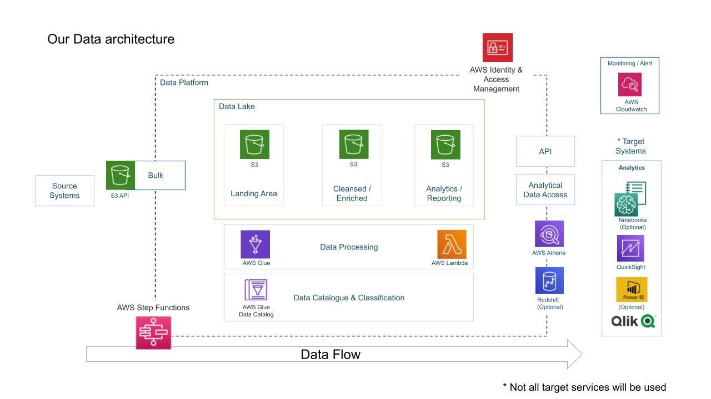

## Résultats

## **Graphique 1 : Nombre de Likes par Catégorie**
Ce graphique montre le nombre total de likes reçus par les vidéos dans différentes catégories. Voici les points clés :
- **Catégorie "People & Blogs"** : Cette catégorie domine largement avec le plus grand nombre de likes, ce qui reflète une forte popularité et un engagement élevé des spectateurs pour les contenus personnels ou informels.
- **Catégories "Entertainment" et "Music"** : Elles occupent respectivement la deuxième et la troisième place, confirmant l'attrait des contenus de divertissement et musicaux auprès du public.
- **Catégories moins populaires** : Les catégories telles que "How-to & Style" et "Gaming" reçoivent relativement peu de likes, indiquant un engagement moindre ou une audience plus ciblée.

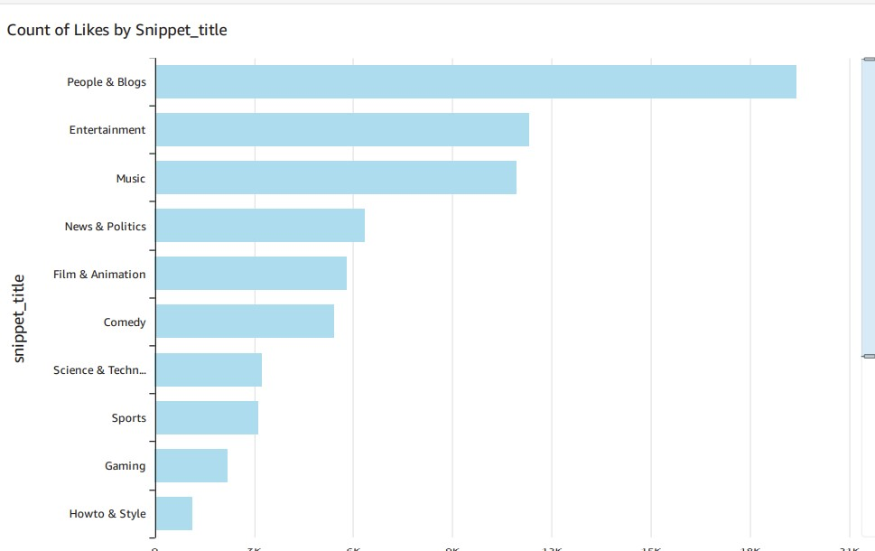 

---

## **Graphique 2 : Somme des Vues par Catégorie**
Ce graphique en camembert illustre la répartition des vues par catégorie. Voici les principales observations :
- **Catégorie "Music"** : Elle représente la plus grande part des vues, confirmant que les vidéos musicales attirent une audience massive.
- **Catégorie "Entertainment"** : Elle se classe en deuxième position, montrant un attrait similaire à celui des vidéos musicales.
- **"Science & Technology" et "Film & Animation"** : Ces catégories ont une présence notable, montrant que le contenu éducatif et créatif suscite un intérêt considérable.
- **Autres catégories** : Les catégories comme "Sports" ou "Travel & Events" ont une part beaucoup plus petite, suggérant un public plus spécialisé.

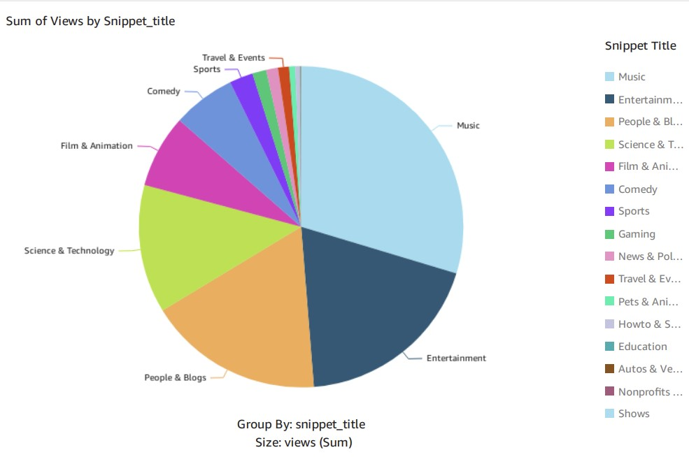

---

## **Graphique 3 : Somme des Vues par Région**
Ce graphique montre la répartition des vues par région (États-Unis, Royaume-Uni, Canada). Voici ce qui en ressort :
- **Royaume-Uni (GB)** : Cette région représente la majorité des vues, ce qui pourrait être dû à un plus grand volume de contenu produit ou à une audience plus active sur YouTube.
- **États-Unis (US)** : Cette région se classe deuxième, avec une part importante, reflétant la large adoption de YouTube dans ce marché.
- **Canada (CA)** : Cette région a la plus petite part des vues parmi les trois, indiquant un public légèrement plus restreint ou une moindre activité sur la plateforme.

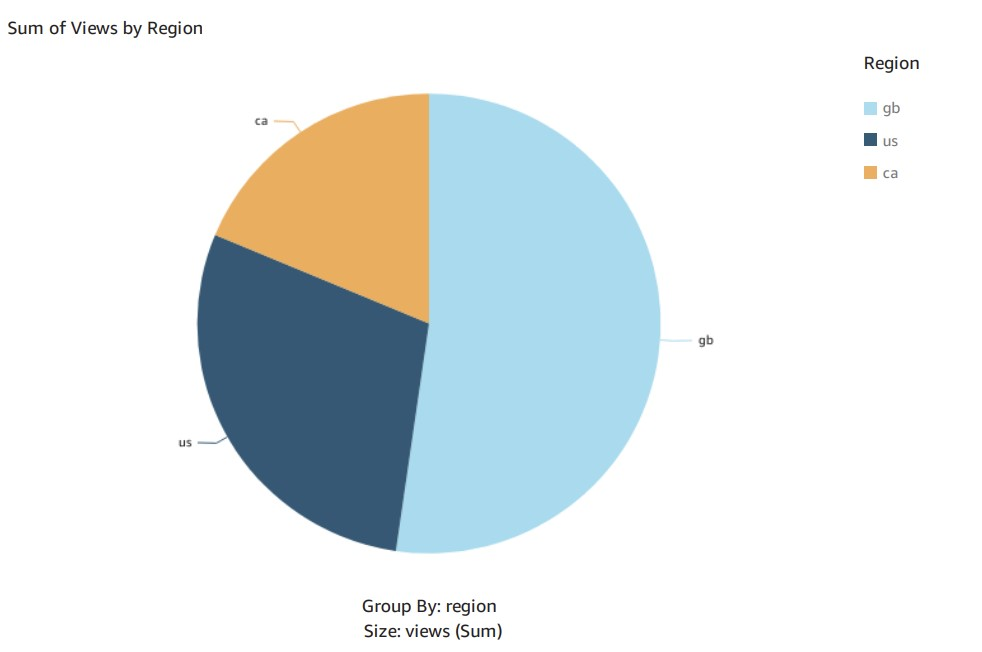

---

## **Graphique 4 : Taux d'engagement par chaîne**
Ce graphique montre le taux d'engagement (somme) pour différentes chaînes YouTube.
La chaîne zefrank1 a le taux d'engagement le plus élevé, suivie par Team Coco et Shawn Mendes.
Il y a une grande disparité dans le taux d'engagement entre les premières chaînes et celles en bas du classement, ce qui peut indiquer que certaines chaînes génèrent beaucoup plus d'interactions (likes, commentaires, etc.) par rapport aux autres.

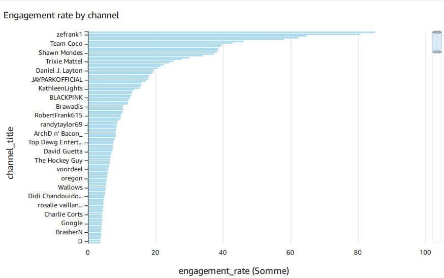

---
## **Graphique 5 : Video avec le plus de vue au Canada**
Vidéo gagnante : "SAD!" de XXXTENTACION, avec 463,789 likes.
Deuxième vidéo : "Are we ready to get married?", avec 439,333 likes (+5.57% de croissance).
Cette vidéo spécifique de XXXTENTACION est la plus populaire au Canada en termes de likes.
La deuxième vidéo montre une croissance significative de likes, ce qui indique une popularité croissante.

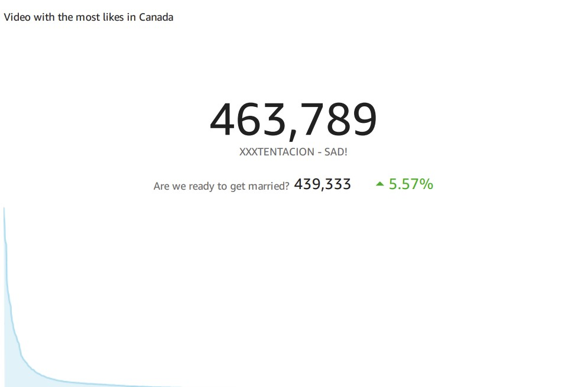

---
## **Graphique 6 : Video avec le plus de vue en grande Bretagne**
Vidéo gagnante : "Logan Paul", avec 1,475,306 likes.
Deuxième vidéo : "SAD!" de XXXTENTACION, avec 1,348,854 likes (+9.37% de croissance).
Logan Paul a un énorme succès au Royaume-Uni, mais la vidéo de XXXTENTACION suit de près avec une croissance encore plus rapide.

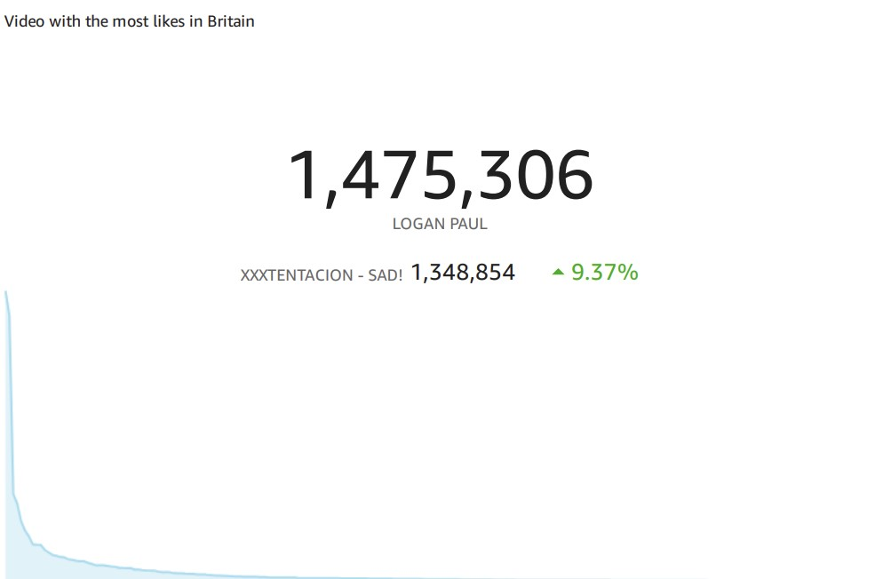

---

## **Graphique 6 : Video avec le plus de vue au US**
Vidéo gagnante : "Are we ready to get married?", avec 494,130 likes.
Deuxième vidéo : "Earth Day 2018 Google Doodle", avec 408,461 likes (+20.97% de croissance).
Les vidéos émotionnelles ou thématiques, comme "Are we ready to get married?" et "Earth Day 2018", ont un fort impact sur le public américain.
La croissance importante de la deuxième vidéo pourrait indiquer une tendance vers des contenus thématiques ou éducatifs.

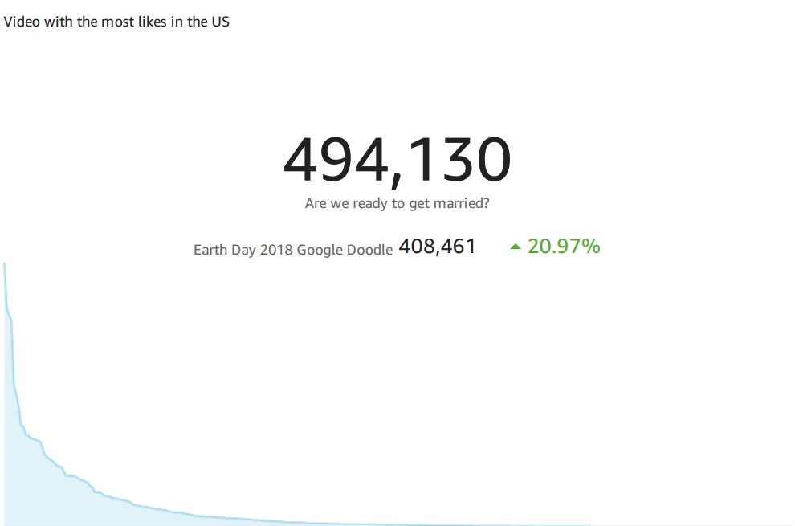

---

## **Graphique 7: Video avec le meilleur ration like/dislike**
Vidéo gagnante : "Farewell.", avec un ratio de 62,695.63.
Deuxième vidéo : "Jay Park X Yultron - Forget About Tomorrow", avec un ratio de 62,177.79 (+0.83% de croissance).
La vidéo "Farewell." a le ratio likes/dislikes le plus élevé, ce qui montre qu'elle est largement appréciée sans générer beaucoup de réactions négatives.
La deuxième vidéo montre une légère croissance dans son ratio, indiquant une réception positive constante.

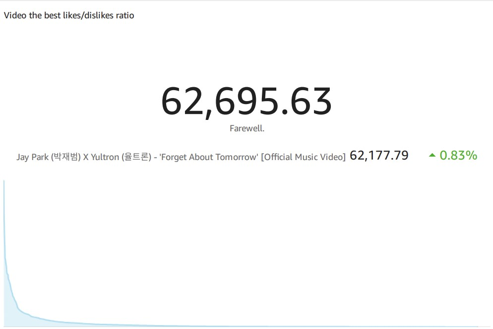

---

## **Graphique 8: nombre de videos par catégorie**
Catégories dominantes :
People & Blogs (Personnes & Blogs)
Entertainment (Divertissement)
Music (Musique)

Catégories moins représentées :
Nonprofits (Associations caritatives)
Autos & Vehicles (Automobiles et Véhicules)

Les catégories populaires comme "People & Blogs" et "Entertainment" montrent que les spectateurs s'intéressent principalement au contenu lié à la vie quotidienne et aux divertissements.
Les catégories comme "Nonprofits" et "Autos & Vehicles" attirent un public de niche.
Conclusion :
Les créateurs qui souhaitent atteindre un large public devraient se concentrer sur les catégories populaires. Les catégories de niche peuvent néanmoins offrir des opportunités pour des audiences spécifiques.

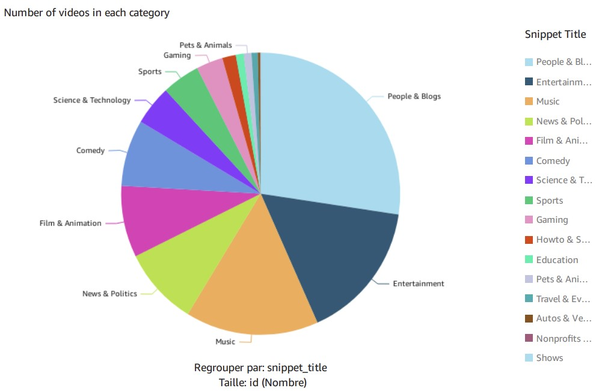

---

## **Graphique 9 : temps en tendance des vidéos**
"BEACH HOUSE" a la durée maximale avec environ 40 jours en tendance, ce qui la positionne comme la vidéo ayant le plus capté l'attention.
Des vidéos comme "Tom Holland" et "The Hamilton" suivent avec des durées légèrement inférieures (approximativement 30-35 jours).
Distribution des durées :

La majorité des vidéos ont passé moins de 20 jours en tendance, ce qui est visible dans la décroissance progressive des barres.
Seules quelques vidéos réussissent à dépasser les 30 jours en tendance, ce qui en fait des cas exceptionnels.
Concentration des tendances :

Les vidéos avec des durées longues (au-delà de 30 jours) pourraient indiquer une audience universelle, un contenu viral ou des sujets de forte actualité.
Les vidéos avec une durée plus courte (< 10 jours) pourraient être liées à des niches spécifiques ou à un intérêt limité au fil du temps.
Points d’analyse potentiels :

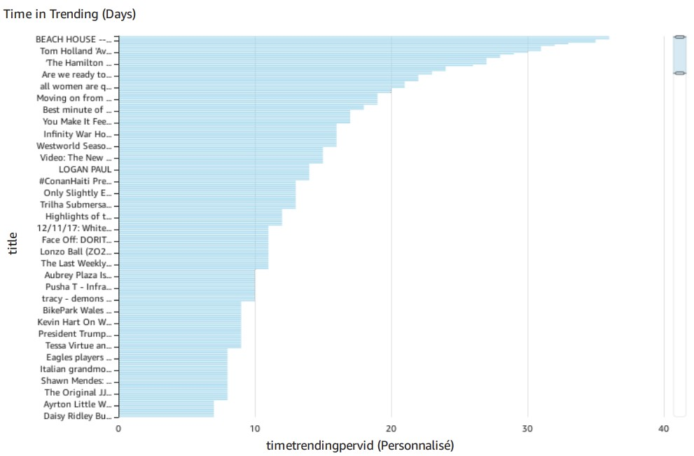

## Scripts utilisés
cleansed-csv-parquet.py
s3_cli_command.sh
lamba.py
### ETL visuel 

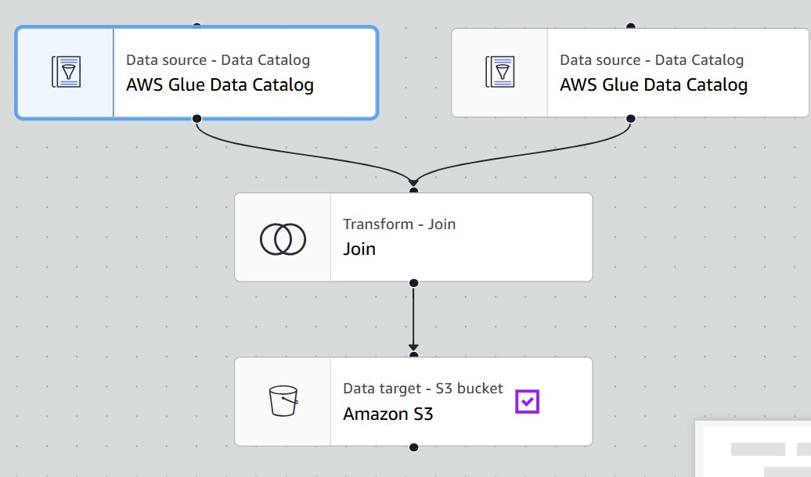

## **Synthèse**
Ces graphiques offrent des informations clés sur les préférences des spectateurs en termes de catégories et leur répartition géographique :
1. **Préférences des catégories** :
   - "People & Blogs" et "Music" se démarquent par leur capacité à générer beaucoup d'engagement (likes) et d'audience (vues).
2. **Répartition géographique** :
   - Le Royaume-Uni domine en termes de vues, suivi par les États-Unis et le Canada.
3. **Insights pour les créateurs** :
   - Les créateurs devraient se concentrer sur les catégories populaires (comme "Music" et "Entertainment") tout en explorant des niches émergentes comme "Science & Technology".

Ces analyses mettent en lumière des opportunités pour maximiser l'impact des vidéos sur YouTube selon les préférences des spectateurs et leur localisation.

